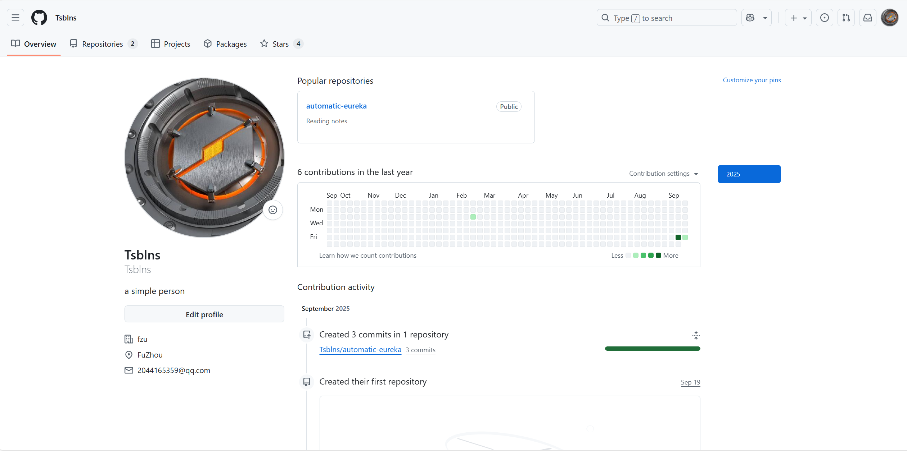

---

# 团队成员个人介绍：张艺宝

## 第一部分：关于我

### 基本信息
*   **姓名：** 张艺宝
*   **在团队中的角色/定位：** 待定
*   **GitHub 用户名：** [\[GitHub主页\]](https://github.com/Tsblns)

### 兴趣爱好
爱好竞技游戏的策略协作，享受整理带来的秩序感，并通过散步沉淀思考。

---

## 第二部分：技能与经验评估

### 成就与成果
*   **学术相关：** 无
*   **项目相关：** 无
*   **其他：** 无
### 专业技能与经验
*   **编程语言：** 了解 Java, Python,  C++, HTML, CSS, JavaScript
*   **技术与框架：** 了解 MySQL, Git 
*   **工具与平台：** 了解 IDEA, VS Code,  Linux
*   **项目经验：** 无

### 自我评估

#### 目前已具备的专业知识与能力
1.  **扎实的基础：** 
2.  **开发能力：**  简单的web开发经验
3.  **协作能力：** 熟悉使用Git进行团队协作开发。

#### 感兴趣的技术方向
1.  **人工智能/机器学习** 
2.  **分布式系统与云计算** 
3.  **Web工程化与用户体：** 

#### 最想学习的知识
*   想系统学习软件工程的理论和最佳实践，提升代码质量和项目管理能力。

---

## 第三部分：未来三年发展规划

### 未来路径选择与目标
我对自己未来三年的主要规划是：读研

### 理由阐述

*   **示例（选择考研）：** 我对目前感兴趣的技术方向认为需要更深厚的理论基础才能进行深入研究和创新，因此希望通过研究生阶段的学习，构建更完整的知识体系，为未来的长远发展打下基础。

### 阶段性目标（2025-2028）
*   **近期目标（未来一年）：**
    *   顺利完成本科学业，保持优异的成绩。
    *   深入学习 Web开发，并完成一个个人项目。
    *   准备技术面试，刷LeetCode题目，复习计算机基础知识。

*   **中期目标（未来两年）：**
    *   成功进入目标院校，进入实验室参与项目。
    *   

*   **长期目标（未来三年）：**
    *   在选择的路径上站稳脚跟，成为团队的技术骨干或是在学术上有所产出。
    *   持续学习，跟踪技术前沿，不断扩大自己的技术影响力。

---

### 个人资料截图

---
**备注：** 本文件由 张艺宝 于 2025年9月26日 创建并提交至团队公共仓库。
