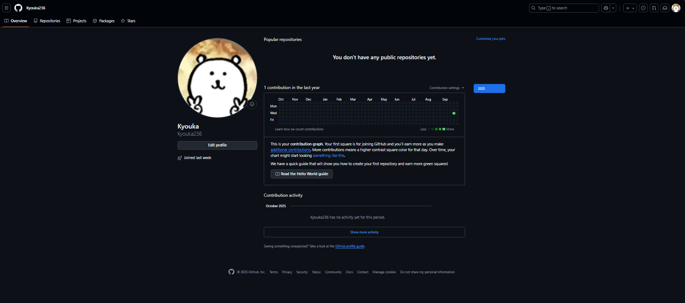

---

# 团队成员个人介绍：范智杰

---

## 第一部分：关于我

### 基本信息

* **姓名：** 范智杰
* **在团队中的角色/定位：**待定
* **GitHub 用户名：** ?https://github.com/Kyouka236

### 兴趣爱好

我平时喜欢打球、看电影和打游戏，这些兴趣让我在学习之余保持放松，同时也能从不同的领域获得灵感。我希望在学习和生活中不断积累经验，提升自我。

---

## 第二部分：技能与经验评估

### 成就与成果

* **学术相关：**暂无
* **项目相关：**暂无
* **其他：**暂无

### 专业技能与经验

* **编程语言：** 熟悉 C/C++/Python基础语法及常用算法
* **技术与框架：** 初步了解MySQL, Git
* **工具与平台：** 了解IntelliJ IDEA, VS Code, Linux的使用方法
* **项目经验：**暂无

### 自我评估

#### 目前已具备的专业知识与能力

1. **扎实的基础：** 熟悉 C/C++/Python基础语法及常用算法
2. **开发能力：** 能够进行基本的程序设计与调试
3. **协作能力：**对团队协作开发和版本控制有一定的了解

#### 感兴趣的技术方向

技术兴趣方向：计算机视觉、图像识别等人工智能相关领域

#### 最想学习的知识

深入掌握人工智能与深度学习的相关技术，提升项目实战能力

## 第三部分：未来三年发展规划

### 未来路径选择与目标

我对自己未来三年的主要规划是：**顺利就业，找到一份与自己专业背景契合并能持续成长的工作。**

### 理由阐述

我性格偏向实践，喜欢快速看到成果，并且希望通过在工业界解决真实问题来快速提升自己的技术能力。目前互联网行业虽然竞争激烈，但对优秀工程师的需求依然旺盛，我希望能尽早进入行业积累经验。

### 阶段性目标（2025-2028）

* **近期目标（未来一年）：**

  * 顺利完成本科学业，保持优异的成绩。
  * 夯实编程基础，学习人工智能与计算机视觉相关课程，积累小型项目经验。

* **中期目标（未来两年）：**

  * 参与更多实战项目，提升团队协作能力和工程化水平，逐渐形成个人技术优势。

* **长期目标（未来三年）：**

  * 积极寻找实习与就业机会，锁定目标行业，努力实现毕业后的顺利就业。

---

### 个人资料截图

---

**备注：** 本文件由范智杰于2025年10月04日 创建并提交至团队公共仓库。

---

